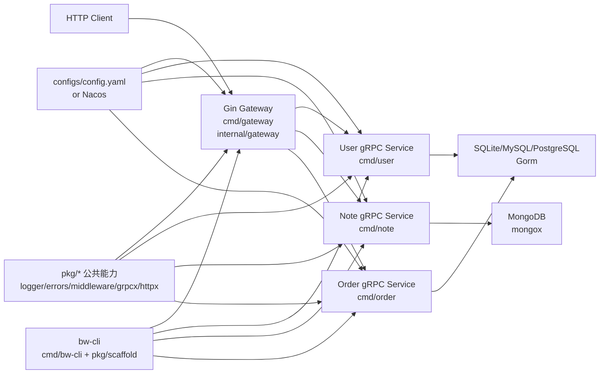

# 项目入门资料

## 1. 项目定位

`xiaolanshu` 当前仓库是 `bw-cli` Go 微服务脚手架本体，同时保留了可运行的演示服务。它面向企业级后端项目，提供 Gin HTTP Gateway、内部 gRPC 服务、Gorm/MongoDB 仓储、公共中间件和脚手架代码生成能力。

仓库有两类使用者：

- 脚手架维护者：维护 `cmd/bw-cli`、`pkg/scaffold`、公共 `pkg/*` 能力和模板文档。
- 业务开发者：基于 demo 或 `bw-cli new/demo/service` 生成和扩展微服务项目。

## 2. 技术栈

| 层级 | 技术 | 当前来源 |
| --- | --- | --- |
| 语言 | Go 1.25+ | `go.mod` |
| HTTP Gateway | Gin | `internal/gateway/router` |
| 内部通信 | gRPC + Protocol Buffers | `api/proto`、`api/gen` |
| ORM | Gorm | `pkg/database`、`internal/*/repo` |
| 关系型数据库 | SQLite、MySQL、PostgreSQL | `pkg/database`、`pkg/mysqlx`、`pkg/postgresx` |
| 文档数据库 | MongoDB 官方 Go Driver | `pkg/mongox` |
| 缓存与消息 | Redis、Kafka、RocketMQ | `pkg/redisx`、`pkg/kafkax`、`pkg/rocketmqx` |
| 搜索 | Elasticsearch v7 client | `pkg/esx` |
| 对象存储 | MinIO、OSS、七牛、腾讯 COS | `pkg/filex` |
| 支付 | Alipay SDK | `pkg/alipayx` |
| 配置 | 本地 YAML + 可选 Nacos | `pkg/config`、`pkg/nacosx` |
| 日志 | Zap + Lumberjack | `pkg/logger` |
| 测试 | Go testing + testify | `*_test.go` |
| 构建工具 | Makefile、Docker、docker-compose | 根目录配置 |

## 3. 总体架构



架构模式是一个 Go 单仓库中的微服务脚手架。对外是 REST 风格 HTTP API，对内是 gRPC。服务内部按 DDD 风格分层，公共基础设施能力集中在 `pkg`。

## 4. 关键目录

| 路径 | 用途 |
| --- | --- |
| `api/proto` | gRPC 契约源文件，按服务和版本组织 |
| `api/gen` | `make proto` 生成的 Go protobuf 代码 |
| `cmd/gateway` | HTTP Gateway 启动入口 |
| `cmd/user`、`cmd/note`、`cmd/order` | 演示服务启动入口 |
| `cmd/bw-cli` | 脚手架命令行入口 |
| `internal/gateway` | Gin 路由、HTTP DTO、HTTP handler、gRPC clients |
| `internal/{user,note,order}` | 业务服务分层实现 |
| `pkg/config` | 本地 YAML/Nacos 配置加载 |
| `pkg/errors` | HTTP/gRPC 共享错误模型和协议映射 |
| `pkg/httpx` | HTTP 统一响应结构 |
| `pkg/grpcx` | gRPC request_id 透传和日志拦截器 |
| `pkg/middleware` | CORS、JWT、RequestID、HTTP 请求日志 |
| `pkg/database`、`pkg/mysqlx`、`pkg/postgresx` | 关系型数据库初始化 |
| `pkg/mongox` | MongoDB client 和通用 DocumentStore |
| `pkg/scaffold` | `bw-cli new/demo/service/delete-service` 核心生成逻辑 |
| `tools/protogen` | 跨平台 proto 生成器 |
| `configs` | 运行时配置和 Nacos 开关配置 |
| `docs` | 架构、使用说明、工具包和服务说明 |

## 5. 服务内分层约定

以 `internal/order` 为例：

| 层 | 写什么 | 不写什么 |
| --- | --- | --- |
| `entity` | 聚合、业务错误、仓储接口、稳定规则 | Gorm/BSON tag、协议对象 |
| `dto` | service 入参命令和出参 DTO | 数据库查询 |
| `service` | 用例编排、分页默认值、调用仓储接口 | Gin/gRPC 对象、数据库细节 |
| `model` | Gorm 表结构、MongoDB 文档结构 | 查询逻辑、业务错误 |
| `repo` | Gorm/MongoDB 实现、entity/model 映射 | 协议适配 |
| `handler` | gRPC request/response 适配、错误映射 | 直接操作数据库 |

Gateway 也拆分为：

- `request`：HTTP 入参 DTO 和 Gin binding tag。
- `handler`：绑定入参、调用 gRPC client、统一 HTTP 响应。
- `router`：版本化路由注册。
- `client`：创建并关闭下游 gRPC client。

## 6. HTTP 接口文档

统一响应外壳：

```json
{
  "request_id": "optional-request-id",
  "data": {},
  "error": {
    "code": "error_code",
    "message": "error message"
  }
}
```

### 健康检查

| 方法 | 路径 | 鉴权 | 说明 |
| --- | --- | --- | --- |
| GET | `/healthz` | 否 | 返回 `{"status":"ok"}` |

### User API

| 方法 | 路径 | 鉴权 | 入参 | 下游 RPC |
| --- | --- | --- | --- | --- |
| POST | `/api/v1/users/register` | 否 | JSON: `account`、`display_name`、`password` | `UserService.Register` |
| POST | `/api/v1/users/login` | 否 | JSON: `account`、`password` | `UserService.Login` |
| GET | `/api/v1/users/me` | Bearer JWT | 无 | `UserService.GetUser` |
| GET | `/api/v1/users/:id` | 否 | path: `id` | `UserService.GetUser` |

登录成功返回：

```json
{
  "data": {
    "user": {
      "id": "1",
      "account": "ada@example.com",
      "display_name": "Ada"
    },
    "token": "<jwt>"
  }
}
```

### Note API

| 方法 | 路径 | 鉴权 | 入参 | 下游 RPC |
| --- | --- | --- | --- | --- |
| POST | `/api/v1/notes` | 否 | JSON: `author_id`、`title`、`content` | `NoteService.CreateNote` |
| GET | `/api/v1/notes/:id` | 否 | path: `id` | `NoteService.GetNote` |
| POST | `/api/v1/notes/publishNote` | 否 | JSON: `author_id`、`title`、`content`、`note_type`、`permission`、`topic_ids`、`status` | `NoteService.PublishNote` |

`note_type` 当前注释为 `0=图文 1=视频`，`permission` 为 `0=公开 1=私密`。service 内部用 `status == 1` 作为草稿，否则发布。

### Order API

| 方法 | 路径 | 鉴权 | 入参 | 下游 RPC |
| --- | --- | --- | --- | --- |
| POST | `/api/v1/orders` | 否 | JSON: `name`、`description` | `OrderService.CreateOrder` |
| GET | `/api/v1/orders` | 否 | query: `page`、`page_size` | `OrderService.ListOrders` |
| GET | `/api/v1/orders/:id` | 否 | path: `id` | `OrderService.GetOrder` |
| PUT | `/api/v1/orders/:id` | 否 | JSON: `name`、`description` | `OrderService.UpdateOrder` |
| DELETE | `/api/v1/orders/:id` | 否 | path: `id` | `OrderService.DeleteOrder` |

分页默认值在 `internal/order/service` 中处理：`page <= 0` 时为 1，`page_size <= 0` 时为 20，最大 100。

## 7. gRPC 契约

| 服务 | proto | RPC |
| --- | --- | --- |
| `UserService` | `api/proto/user/v1/user.proto` | `Register`、`Login`、`GetUser` |
| `NoteService` | `api/proto/note/v1/note.proto` | `CreateNote`、`GetNote`、`PublishNote` |
| `OrderService` | `api/proto/order/v1/order.proto` | `CreateOrder`、`GetOrder`、`ListOrders`、`UpdateOrder`、`DeleteOrder` |

生成命令：

```bash
make tools
make proto
```

`tools/protogen` 会扫描 `api/proto` 下所有 `.proto`，输出到 `api/gen`，并自动把 Go 插件路径加到 `PATH`。

## 8. 请求生命周期

### 注册用户

```text
POST /api/v1/users/register
  -> internal/gateway/router/user_routes.go
  -> internal/gateway/handler.UserHandler.Register
  -> request.RegisterUserRequest binding 校验
  -> UserService.Register gRPC client
  -> internal/user/handler.Server.Register
  -> internal/user/service.Service.Register
  -> entity.NormalizeAccount + 唯一性检查 + 密码哈希
  -> internal/user/repo.GormRepository.Save
  -> xls_user 表
  -> gRPC 返回 UserResponse
  -> gateway 生成 201 Created 统一 JSON
```

### 登录并访问当前用户

```text
POST /api/v1/users/login
  -> gateway 调 UserService.Login
  -> service 校验账号和密码
  -> gateway 使用 middleware.GenerateToken 生成 JWT
  -> 返回 user + token

GET /api/v1/users/me
  -> middleware.JWTAuth 校验 Bearer token
  -> ClaimsFromContext 读取 user_id
  -> UserService.GetUser
  -> 返回当前用户资料
```

### 创建订单

```text
POST /api/v1/orders
  -> OrderHandler.Create
  -> request.CreateOrderRequest binding 校验 name
  -> OrderService.CreateOrder
  -> order service 创建 entity.Order
  -> GormRepository.Save 写入 orders 表
  -> gateway 返回 201 Created
```

### 发布笔记

```text
POST /api/v1/notes/publishNote
  -> NoteHandler.PublishNote
  -> NoteService.PublishNote
  -> note service 组装 PublishNoteCommand
  -> entity.NewNote 校验 author/title/content
  -> status=1 保存草稿，否则调用 Note.Publish
  -> MongoRepository.Save 通过 mongox.DocumentStore UpsertByID
  -> gateway 返回 200 OK
```

## 9. 配置与运行时

核心配置在 `configs/config.yaml`：

- HTTP Gateway 默认监听 `0.0.0.0:8080`。
- gRPC host 默认 `0.0.0.0`。
- `user` 默认 `9001`，`note` 默认 `9002`，`order` 默认 `9100`。
- 关系型数据库默认 `mysql`，DSN 是 `账号:密码@tcp(服务器IP:3306)/数据库?charset=utf8mb4&parseTime=True&loc=Local`。
- MongoDB 默认 `mongodb://127.0.0.1:27017`，数据库 `xiaolanshu`。
- JWT 配置在 `middleware.jwt`，生产必须设置 `secret`。
- 日志默认写入 `logs/*.log`，按服务名和日期生成。

`configs/nacos.yaml` 控制是否从 Nacos 拉取完整业务配置。当前默认 `enabled: false`。如果启用 Nacos，`config.Load` 会优先拉 Nacos；失败时是否回退本地取决于 `fail_fast`。

注意：当前代码未检测到通用环境变量覆盖配置的逻辑，运行时主要以 `configs/config.yaml` 或 Nacos 内容为准。容器内服务地址需要同步到配置或 Nacos。

## 10. 开发流程

### 本地维护脚手架

```bash
make tools
make proto
make test
make run-user
make run-note
make run-order
make run-gateway
```

推荐启动顺序：

1. `make run-user`
2. `make run-note`
3. `make run-order`
4. `make run-gateway`

### 使用 CLI 生成项目

```bash
go install ./cmd/bw-cli

bw-cli new ../my-service \
  --module github.com/acme/my-service \
  --source . \
  --tidy

bw-cli demo ../demo-service \
  --module github.com/acme/demo-service \
  --source . \
  --tidy
```

`new` 生成干净 Gateway 和公共包，不带 demo 业务。`demo` 保留 user/note 示例，用于学习完整调用链。

### 新增服务

```bash
bw-cli service product --port 9200 --tidy
```

生成内容包括：

- `api/proto/product/v1/product.proto`
- `api/gen/product/v1`
- `cmd/product`
- `internal/product/{entity,dto,service,model,repo,handler}`
- `internal/gateway/{request,handler,router}` 中对应 HTTP 入口
- `Makefile` 的 `run-product`
- `configs/config.yaml` 的 `services.product`

建议开发顺序：

1. 先调整 `api/proto/<service>/v1/*.proto`。
2. 执行 `make proto`。
3. 在 `entity` 定业务实体、错误和仓储接口。
4. 在 `dto` 定命令和返回 DTO。
5. 在 `service` 编排用例。
6. 在 `model` 和 `repo` 实现持久化。
7. 在 `handler` 做 gRPC 适配和错误映射。
8. 在 Gateway 的 `request/handler/router` 补 HTTP 入口。
9. 补单元测试并运行 `make test`。

### 删除服务

```bash
bw-cli delete-service product --tidy
```

该命令会移除生成文件、Makefile target、配置项和 Gateway 注册，并按需重新生成 proto。

## 11. 测试与质量门禁

当前测试命名统一为 `*_test.go`，运行：

```bash
make test
go test ./...
```

重点已有覆盖：

- Gateway 路由与请求 DTO。
- user/note/order service 业务用例。
- user/note 仓储。
- config、logger、nacos、mongox、kafkax、alipayx、scaffold、protogen 等公共包。

改动建议：

- 改 proto 或 generated code：运行 `make proto` 后再 `make test`。
- 改 gateway 路由/handler：补 `internal/gateway` 对应测试。
- 改 service 业务规则：优先补 service 层单元测试。
- 改 repo：用 fake/store 或临时数据库覆盖错误路径。
- 改 scaffold：必须覆盖生成路径和删除路径，避免破坏 CLI 输出。

## 12. 命名与代码约定

- Go package 目录使用小写，服务名允许 CLI 输入 `kebab-case` 或 `snake_case`，生成目录归一为 `snake_case`。
- gRPC proto 按 `api/proto/<service>/v1/<service>.proto` 组织。
- 生成 Go package 形如 `userv1`、`notev1`、`orderv1`。
- Handler 方法使用 `Create/Get/List/Update/Delete` 或业务动作名。
- 错误优先在 `entity` 定义 sentinel error，再在 gRPC handler 映射为 `pkg/errors.AppError`。
- HTTP handler 不直接访问数据库，只绑定请求、调用 gRPC client、写统一响应。
- service 层只依赖 entity 和 repository interface。
- model 层只放持久化结构，不放业务规则。
- repo 层负责 entity/model 转换。

## 13. Git 约定

从近期提交看，提交信息主要采用 Conventional Commits 风格：

```text
feat(scaffold): 修复表服务生成并增加删除命令
refactor(scaffold): 调整实体与数据库模型分层
docs(code): 将源码注释改为中文
```

也存在少量历史非标准提交。新提交建议使用：

```text
<type>(scope): 中文动词开头摘要
```

常用 type：`feat`、`fix`、`refactor`、`docs`、`test`、`chore`。

## 14. 项目资料入口

| 想了解 | 看这里 |
| --- | --- |
| 项目定位和快速启动 | `README.md` |
| 使用流程 | `docs/usage.md` |
| 架构分层 | `docs/architecture.md` |
| 公共工具包 | `docs/toolkit.md` |
| MongoDB 封装 | `docs/mongodb.md`、`docs/mongo-call-examples.md` |
| Nacos 配置 | `docs/nacos.md` |
| Alipay 封装 | `docs/alipay.md` |
| Elasticsearch 封装 | `docs/elasticsearch.md` |
| Order 服务示例 | `docs/services/order.md` |
| 代码关系图 | `graphify-out/GRAPH_REPORT.md` |

## 15. 当前已知注意点

- `note` 服务当前入口使用 MongoDB 仓储，不是 Gorm 仓储；需要本地 MongoDB 可连通才能运行 `make run-note`。
- `user` 和 `order` 默认使用 `pkg/database.Open`，当前配置下连接 MySQL；启动前需要把 `mysql.dsn` 替换为真实连接串。
- `middleware.jwt.secret` 默认空字符串，正式联调前应配置真实 secret。
- `docker-compose.yml` 里设置了 `APP_GRPC_USER_TARGET`、`APP_GRPC_NOTE_TARGET`，但当前配置加载代码未发现环境变量覆盖逻辑；容器化联调时应重点确认服务发现配置。
- `Dockerfile` 当前构建 gateway/user/note，未构建 order；如果需要容器化 order 服务，需要同步调整镜像构建和 compose。
